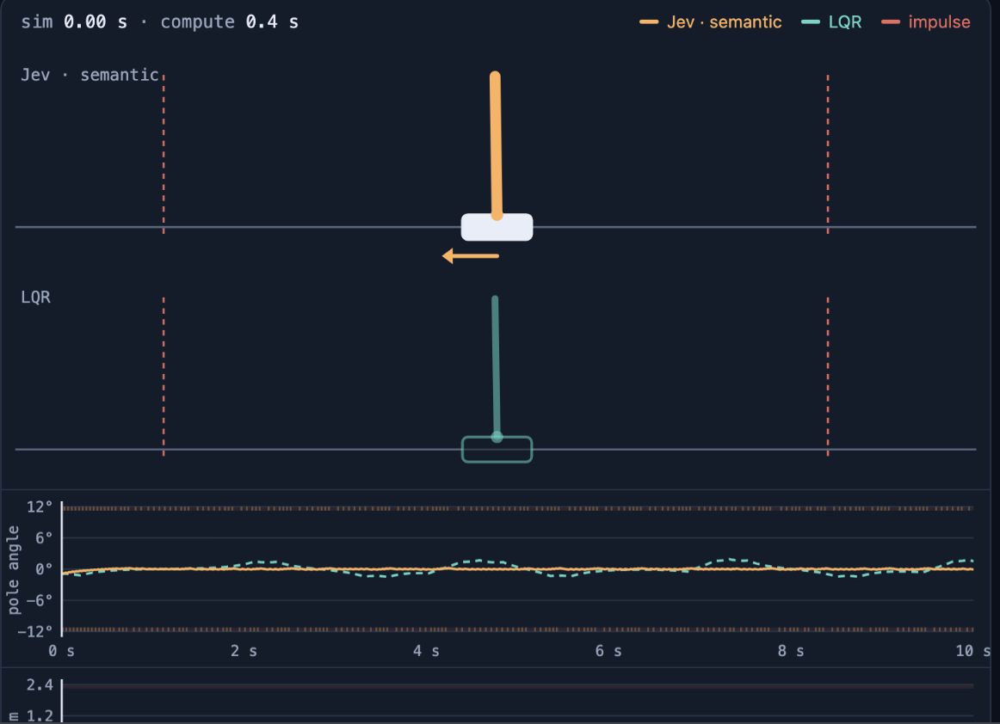
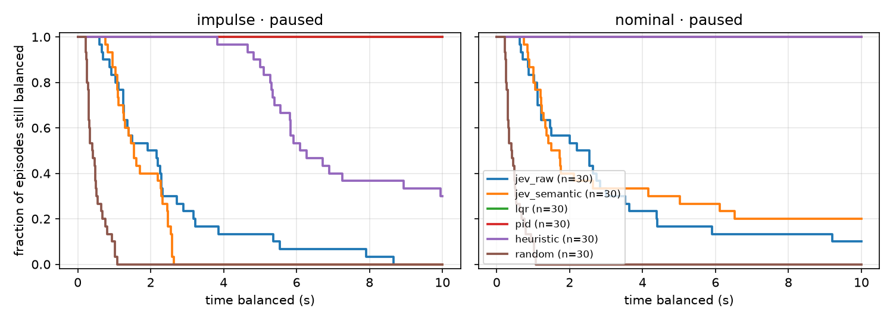

# jev-controller

Can [Jev](https://typesafe.ai) balance a pole?

Every 20 ms we sent Jev the CartPole state (cart position and speed, pole angle and spin) and asked
it to pick a push: −10, −5, 0, +5 or +10 N. Jev did all the steering. For comparison we ran LQR,
PID, a one-line heuristic and random pushes on the same seeds. `jev_semantic` also got plain-English
labels like "slight lean to the right". The simulation pauses while Jev thinks, because at ~400 ms
per answer, nothing could keep up in real time.



## How it went

Jev sometimes balances the full 10 seconds and usually beats random
by a lot. It never survives a shove, and LQR wins every time.



| | full 10 s, no shoves | full 10 s, with shoves |
|---|---|---|
| Jev (raw numbers) | 3/30 | 0/30 |
| Jev (with labels) | 6/30 | 0/30 |
| LQR / PID | 30/30 | 30/30 |
| heuristic | 30/30 | 9/30 |
| random | 0/30 | 0/30 |

The final run was 16k API calls for about $0.56. Details:
[docs/test-summary.md](docs/test-summary.md).

## Run it

```sh
uv sync                     # put TYPESAFE_API_KEY in .env
uv run jev-demo estimate --episodes 5
uv run jev-demo --allow-paid --max-calls 10000 run --episodes 5
uv run jev-demo player      # builds the replay page
```

